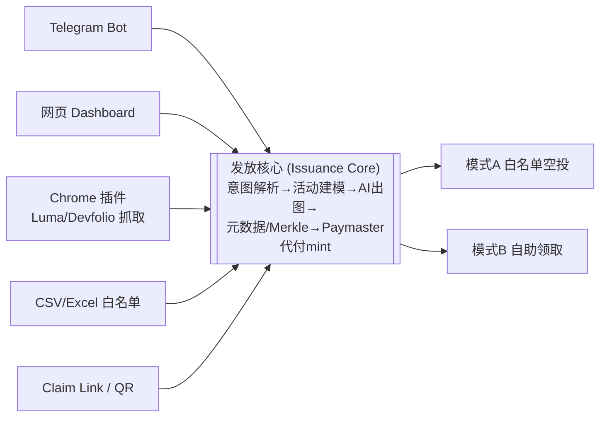
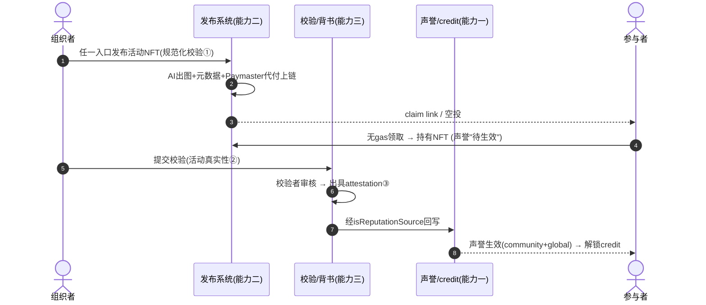

# MyNFT / OpenEvent NFT (OEN) — 总体设计与路线图

> 三大能力的总设计。本文是顶层蓝图，关联文档：
> - `docs/ProductDesign.md` — 早期产品设计（模块/合约/流程细节）
> - `docs/ReputationResearch.md` — 生态声誉系统调研（接入点与缺口）
> - `docs/hardware/README.md` — NFC「必须到场」签到硬件子方案（能力三的物理实现）
> - `docs/Solution.md` — 原始脑暴

---

## 0. 一图看懂：NFT 是「带声誉的活动凭证」

MyNFT 不是又一个发图工具。它发出的每一枚 NFT 都是**可验证的参与证明（attestation）**，最终沉淀为用户的链上声誉与 credit。三大能力是这条流水线上的三段：

```
        发布系统(嘴)            管理与校验(闸)            生态嵌入(家)
   ┌──────────────────┐   ┌────────────────────┐   ┌──────────────────────┐
   │ 多入口发 NFT      │ → │ 规范化→校验→背书   │ → │ 写入 reputation→credit│
   │ Telegram/网页/    │   │ schema/verify/     │   │ ReputationSystem +    │
   │ CSV/claim link/   │   │ attestation        │   │ MySBT + Registry +    │
   │ Chrome 插件       │   │ (谁能计入声誉的闸) │   │ SuperPaymaster(gasless)│
   └──────────────────┘   └────────────────────┘   └──────────────────────┘
        Goal 2                  Goal 3                      Goal 1
```

- **嘴（发布）**：让发 NFT 这件事在任何场景下都极低门槛——这是 MyNFT 的独有价值，现有生态缺这一段。
- **闸（管理/校验）**：不是每枚 NFT 都配进声誉。闸保证「真活动 + 真参与 + 规范一致」才放行，防女巫/防自刷。
- **家（生态嵌入）**：放行后的 NFT 进入已有的声誉/credit 飞轮（调研已确认下游约 70% 已存在，零新合约接入）。

---

## 1. 角色与核心对象

| 角色 | 是谁 | 在三大能力里的动作 |
|---|---|---|
| **Organizer 组织者** | 社区运营/活动主办 | 发布 NFT、管理活动、提交校验、移交多签 |
| **Attendee 参与者** | 普通用户（可无钱包） | 签到/领取、查看自己的 NFT 与声誉 |
| **Verifier 校验者** | 社区多签 / DVT 节点 / 协议 | 校验活动真实性、出具 attestation |
| **Community DAO** | 社区治理体 | 定义计分规则、最终持有 collection |

核心对象（延续 `ProductDesign.md`）：`Event`、`NFT Asset (POAP-compatible)`、`Claim Proof`、`User Identity (MySBT/AA)`，**新增** `Attestation`（NFT↔活动↔声誉资格的可信绑定）。

---

## 2. 能力一 · 生态嵌入（Goal 1 · 家）

**目标**：MyNFT 发的 NFT 自动转化为 community / global 双层声誉，**不自己写声誉合约**。

### 2.1 声誉数据契约（Reputation Data Contract）

这是 MyNFT 与生态之间的「接口约定」。一枚 NFT 要成为「计入声誉的凭证」，必须携带：

```yaml
# 每个 collection 发布时声明（reputation manifest，可视化表单生成）
collection: 0x...              # NFT 合约地址
issuer:                        # 发行方身份（须有 Registry 角色）
  community: 0x...
  role: ROLE_COMMUNITY / ROLE_ORGANIZER
reputation:
  scope: community | global    # 计入社区内还是全局声誉
  category: "hackathon"        # 活动类别（对应 ReputationSystem.setRule 的 ruleId）
  weight: 3                    # 每枚 NFT 加分（默认 +3，对齐 IReputationCalculator）
  min_hold_days: 7             # 防刷：持有满 N 天才计入
poap:                          # POAP 兼容元数据（硬要求）
  event_id / city / country / date / image
```

### 2.2 三条接入路径（由浅入深，对应路线图阶段）

| 路径 | 机制 | 信任级别 | 用在哪个阶段 |
|---|---|---|---|
| **A. NFT-Boost（纯链上）** | `ReputationSystem.setNFTBoost(collection, boost)` → 持有≥7天 + `balanceOf>0` 自动加分 | 低（信任发行方） | Phase 1 最小闭环 |
| **B. 社区规则** | 社区 `ReputationSystem.setRule(ruleId, base, bonus, max)` + `MySBT.recordActivity` 打活跃点 | 中 | Phase 3 |
| **C. 可信回写** | 校验后经 `isReputationSource` 白名单 / DVT-BLS → `setCommunityReputation` / `batchUpdateGlobalReputation` | 高（attestation 背书） | Phase 3 |

> 调研缺口提醒：`setNFTBoost` 当前 onlyOwner（协议方），`computeScore` 依赖链下喂数。**能力三（校验/attestation）正是补这两个缺口的那一层**——它就是那个可信数据源。

### 2.3 身份与无 gas

- 领 NFT 的用户若无身份，走 `MySBT` 的 `ROLE_ENDUSER` 自助或 gasless airdrop（见 `registry/MINT-SBT-BUSINESS-DESIGN.md`）。
- mint/claim + AA 账户部署全部由 **SuperPaymaster** 代付，零 ETH 门槛。

---

## 3. 能力二 · NFT 发布系统（Goal 2 · 嘴）

**目标**：一句话、一张表、一个链接——任何场景都能低门槛发 NFT。Telegram 只是其中一个入口。

### 3.1 架构：发放核心 + 入口适配器

所有入口收敛到同一套「发放核心」，避免每种渠道各写一遍：



**入口适配器**只做一件事：把各自的输入翻译成发放核心的标准请求 `IssueRequest{event, nftSpec, distribution}`。新增渠道 = 新增一个适配器，核心不动。

### 3.2 两种分发模式（延续设计文档）

- **模式 A · 白名单空投**：上传 CSV(email/address) → 本地算 Merkle Tree（链上只存 root，护隐私）→ Paymaster 代付批量 mint。适合闭门会、内部奖励。
- **模式 B · 自助领取**：claim link/QR → email/passkey 登录 → 推导/部署 AA → Paymaster 代付 mint。适合开放活动、黑客松。

### 3.3 关键场景：组织者发一场黑客松 NFT

**场景 a — Telegram（一句话发布）**
```
组织者 → @OEN_bot:  /publish 清迈黑客松 赛博朋克奖杯 100份 自助领取
Bot   → 🎨 已生成 4 张候选图 [图1][图2][图3][图4]，回复编号选择
组织者 → 2
Bot   → ✅ 已上链(Paymaster代付)。领取链接 t.me/.../claim?e=0x..  二维码👇
        （活动已进入「待校验」，校验通过后计入声誉）
```

**场景 b — Chrome 插件（从 Luma 一键同步）**
```
组织者打开 Luma 活动后台 → 点插件图标 → "Sync Event"
插件抓取：标题/时间/封面 + 150 个报名邮箱
→ 输入一句 prompt 生成 NFT 图 → 选 CSV 空投 → "Deploy & Distribute"
→ 本地算 Merkle root → Paymaster 代付上链 → 导出加密数据包备份
```

### 3.4 参与者领取 UI（模式 B）

```
┌─────────────────────────────┐
│   🎉 你被邀请领取            │
│   「清迈黑客松 2026」纪念 NFT │
│   ┌───────────────┐         │
│   │   [NFT 预览图]  │         │
│   └───────────────┘         │
│   用邮箱登录即可领取（无需钱包）│
│   [ your@email.com        ] │
│   [   ✨ 一键领取（免 gas） ] │
└─────────────────────────────┘
        ↓ 验证白名单 + Paymaster 代付
┌─────────────────────────────┐
│   ✅ 领取成功！              │
│   声誉 +3（待活动校验后生效） │
│   [查看我的声誉] [绑定钱包]   │
└─────────────────────────────┘
```

---

## 4. 能力三 · 管理与校验（Goal 3 · 闸）

**目标**：NFT 要进声誉，必须先过「规范一致 → 活动校验 → 背书」三道闸，防女巫、防自刷、保证可信。这是 MyNFT 区别于普通发图工具的护城河。

### 4.1 三道闸

**① 规范一致（Schema Conformance）— 发布时自动校验**
- 元数据必须符合 §2.1 的声誉数据契约（POAP 字段 + reputation tags + 发行方角色）。
- 发布表单即 lint：缺字段不让发布；类似 PGL 的 `pgl.yml` manifest + 「妈妈测试」严格度。

**② 活动校验（Activity Verification）— 发布后**
- 活动真的发生了吗？（来源链接 Luma/Devfolio、组织者签名、时间戳）
- 这个人真的参与了吗？（现场签到 QR、白名单来源、一人一领去重）
- 产出一个**信任级别**，决定声誉权重：

| 信任级别 | 校验方式 | 声誉权重 |
|---|---|---|
| 🟡 自证 | 组织者自声明 | 低（或仅社区内 scope） |
| 🟠 社区背书 | 社区多签 approve | 中 |
| 🟢 去中心校验 | DVT 节点 / 预言机 / **NFC 现场刷卡**（见 `hardware/README.md`） | 高（可计入 global） |

**③ Attestation（背书上链）**
- 产出 `{NFT, 活动, 资格, 信任级别}` 的可验证 attestation。候选实现：
  - **ERC-8004 ValidationRegistry**（airaccount-contract 已有）— validation 请求/响应模型
  - **DVT-BLS 签名**（生态原生）→ 经 `Registry.isReputationSource` 白名单回写声誉
  - 退化方案：EAS 风格离线 attestation
- **attestation 是声誉系统唯一信任的输入**：能力一的「路径 C」就靠它放行。闸由此把「原始 NFT」升级为「可计入声誉的已背书 NFT」。

### 4.2 管理界面（组织者 Dashboard）

```
┌─ MyNFT 控制台 ───────────────────────────────────────┐
│ 我的活动                              [+ 发布新活动]   │
│ ┌──────────────────────────────────────────────────┐ │
│ │ 清迈黑客松 2026   领取 87/100   🟠社区背书  声誉✓ │ │
│ │   [查看领取] [校验队列(3)] [声誉影响] [移交多签]   │ │
│ ├──────────────────────────────────────────────────┤ │
│ │ AMA #12          领取 40/∞    🟡待校验   声誉⏸    │ │
│ │   [提交校验] ...                                   │ │
│ └──────────────────────────────────────────────────┘ │
│ 校验队列：审核领取真实性 → 批准/驳回 → 出具背书        │
└──────────────────────────────────────────────────────┘
```

核心管理动作：领取统计、**校验队列审批**、声誉影响预览、计分规则配置（`setRule`）、一键移交 collection owner 给 Gnosis Safe。

### 4.3 关键场景：从发布到计入声誉的完整闸流程

```
发布(能力二) → 🟡待校验
   → 组织者「提交校验」/ 现场签到数据上传
   → 校验者(社区多签 或 DVT)审核活动+参与真实性
   → 通过 → 出具 attestation(信任级别) 
   → 经 isReputationSource 回写 ReputationSystem
   → 用户声誉「待生效」→「生效」(community/global 双分数)
```

---

## 5. 端到端用户流程（串起三大能力）



---

## 6. 分阶段路线图（推荐）

原则：**每阶段都交付可用闭环**，信任随阶段加深。Goal↔Phase 不强行一一对应，而按「先打通价值、再加宽入口、最后加固信任」。

### Phase 1 — 发布最小闭环 + 生态地基（≈ Goal 1 地基 + Goal 2 雏形）
- 定义声誉数据契约 / manifest schema（§2.1）。
- 网页单入口发布 1 个活动 → POAP-compatible NFT → Paymaster 代付 → 模式 B 自助领取 → mint 到 AA/MySBT。
- 声誉走**最简纯链上路径 A**（`setNFTBoost` / `balanceOf`）：持有即 +global 声誉，暂「信任发行方」不设校验闸。
- **交付**：组织者网页发活动 NFT，用户无 gas 领，持有即 +声誉。

### Phase 2 — 完整多入口发布系统（Goal 2）
- 发放核心 + 适配器：**Telegram bot**、CSV/Excel 白名单空投（Merkle）、claim link/QR、Chrome 插件(Luma/Devfolio 抓取)。
- 两种分发模式齐全（空投 + 自助）。
- 管理 Dashboard 雏形（活动列表、领取统计、移交多签）。
- **交付**：一句话 / 一张表 / 一个链接，多种方式发 NFT。

### Phase 3 — 校验 / Attestation / 完整管理（Goal 3，可与 Phase 2 后段并行）
- 三道闸：规范化②③ + 活动校验 + attestation（ERC-8004 ValidationRegistry / DVT-BLS）。
- 信任级别 → 声誉权重；接入路径 B（社区 `setRule`）+ 路径 C（可信回写），声誉从「持有即加分」升级为「经校验的真实参与才加分」。
- 完整管理：校验队列、声誉影响预览、社区自定义计分规则。
- **交付**：经校验背书的 NFT 才计入声誉，社区可自治计分，防女巫。

| 能力 / Goal | 主要落在 |
|---|---|
| Goal 1 生态嵌入 | Phase 1 地基（路径A）→ Phase 3 加深（路径B/C） |
| Goal 2 发布系统 | Phase 2（核心）+ Phase 1（雏形） |
| Goal 3 管理校验 | Phase 3 |

> 也可按用户设想「一阶段一能力」串行（Goal1→2→3）；但推荐上面的「垂直切片」法，能在 Phase 1 就跑出 publish→hold→+reputation 的完整体验。

---

## 7. 技术栈与复用点

| 层 | 选型 | 复用 |
|---|---|---|
| 发布入口 | Chrome 插件(React+Plasmo) / Telegram Bot / Web | CoS72 的 `CreateCommunityNFTDialog`/`SendNFTDialog` 参照 |
| 发放核心 | 本地服务(Rust, Merkle/IPFS/AI) | OEN `ProductDesign.md` Local Core |
| NFT 合约 | ERC-721/1155 POAP-compatible | 与 ReputationSystem `balanceOf` 兼容 |
| 无 gas | **SuperPaymaster** (ERC-4337) | 零新合约 |
| 身份 | **MySBT** + AirAccount(AA/passkey) | 零新合约 |
| 声誉 | **ReputationSystem** + Registry | 零新合约，仅接入 |
| 校验/背书 | ERC-8004 ValidationRegistry / DVT-BLS / EAS | airaccount-contract 已有接口 |

**唯一可能需要新增的合约/治理动作**：让社区能自助把自己的 collection 注册进声誉系统（解决 `setNFTBoost` onlyOwner 缺口）——需与 SuperPaymaster 团队对齐（可能是一个受 Registry 角色门控的 `OEN_Registry` 轻合约）。

---

*下一步：待 Telegram 发 NFT 子模块代码到位，作为 Phase 2 的首个入口适配器接入「发放核心」。*
