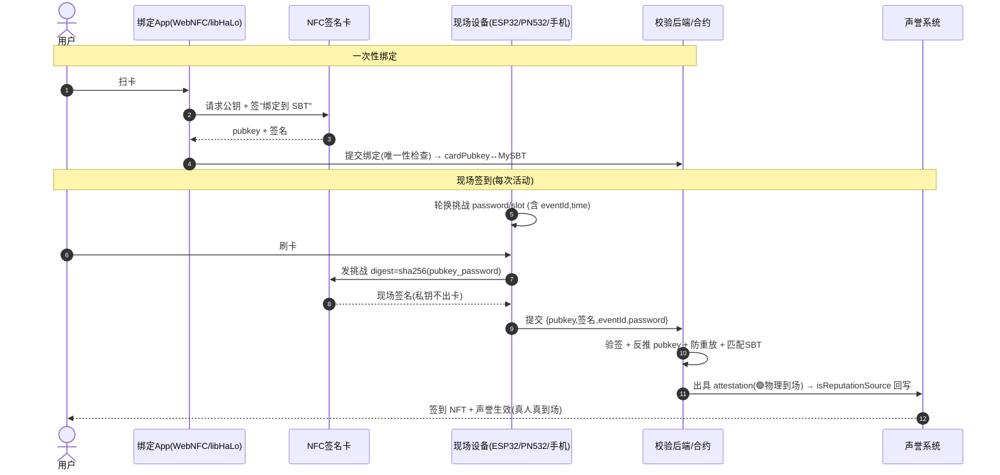

# MyNFT 硬件延伸方案 · NFC「必须到场」签到（Side Project）

> 本目录是 MyNFT 的硬件子方案：用 NFC 实现**强制物理到场**的签到，签到结果作为最高信任级别的 attestation 喂入声誉系统。
> 关联：`docs/Design.md`（能力三 · 管理与校验 / 活动校验的 🟢 去中心校验级别）。
> 本文所有「开源参考」均经实地仓库调研与分析（见 §6），非凭空罗列。

---

## 1. 定位

普通 NFC 签到（读卡 UID）**无法证明到场**——UID 可被复制、可远程中继，等于一张可伪造的工牌。MyNFT 要的是「**人必须亲自到现场刷卡才算数**」，并且这次刷卡能映射到唯一的人（其 MySBT）。

这套硬件方案是 `Design.md` 里**能力三「活动校验」的物理实现**：一次合法的现场刷卡 = 一条 🟢 最高信任级别的 attestation → 经 `isReputationSource` 回写 → 声誉生效。它把「持有即加分」升级为「**真人真到场才加分**」，是防女巫的物理护城河。

---

## 2. 核心密码学洞察（为什么这样设计才成立）

| 朴素做法 | 问题 | 本方案 |
|---|---|---|
| NFC 卡存一个 UID | UID 可读可复制，无法防克隆/中继 | 卡内是**安全芯片（secp256k1 密钥对）**，私钥不出芯片，**每次刷卡现签一个新挑战** |
| 卡 = 一个 NFT | 卡可转手即冒名 | 卡公钥与用户 **MySBT 1:1 绑定**，绑定全局只允许一份 → 一人一卡 |
| 后端记一条「来过」 | 可被重放 | 挑战含**轮换 password / 时间槽**（防重放）+ eventId + 设备 → 证明「此刻、此地、此卡」 |

**到场为什么被保证**：① 私钥锁在安全元件里，不能像 UID 那样被克隆；② 挑战是现场新鲜生成的，离场后签不出有效签名（防重放）；③ 卡↔SBT 唯一绑定，签名能反推出究竟是谁；④ 读卡设备物理在会场，刷卡=到场。

> 这套「芯片签名 + 链上校验 + 时间/地点新鲜性」正是 Arx `poirl`（Proof of In Real Life）已验证的模型，可直接借鉴（§6.1）。

---

## 3. 三大组件（对应你列的三件套）

```
┌── 用户侧 ──────────────┐        ┌── 现场侧 ──────────┐        ┌── 链上/后端 ──────┐
│ ① NFC 绑定 App         │        │ ③ 现场签到设备      │        │ 校验签名→匹配SBT  │
│   卡公钥 ↔ MySBT 绑定   │        │   出挑战+读签名      │ ────►  │ →出 attestation   │
│ ② 通用 NFC 卡(签名芯片) │ ◄──刷── │   ESP32/PN532 或     │        │ →回写ReputationSys│
│   私钥不出卡            │   tap   │   手机/RaspberryPi   │        │ →声誉/NFT 生效    │
└────────────────────────┘        └─────────────────────┘        └───────────────────┘
```

### ① NFC 绑定 App（用户，一次性）
- 功能：扫卡读公钥 → 让卡签一条「我要绑定到 SBT X」→ 提交链上/后端建立 `cardPubkey ↔ MySBT` 唯一映射。绑定占用即锁死（已绑的卡不能再绑别人）。
- 形态：**优先 WebNFC**（Chrome/Android、Safari/iOS，**用户免装 App**，直接网页刷卡）；备选 React Native / Flutter。
- 技术底座：`libHaLo`（§6.1）的 `execHaloCmdWeb` / `execHaloCmdRN`。

### ② 通用 NFC 卡（用户持有，签名安全元件）
三种选型（详见 §7）：
- **A 开箱即用**：Arx HaLo 卡/贴片（turnkey，secp256k1 签名，libHaLo 直接驱动）。
- **B 主权开源**：通用 JavaCard 烧开源 applet（Satochip/Satodime 系，§6.2），硬件可自持自烧，契合 Mycelium「self-runable」精神。
- **C 物理背书 NFT**：卡即 ERC-5791 PBT 的物理载体（§6.3）。

### ③ 现场签到设备（主办方，会场终端）
- 功能：生成/轮换挑战（password 或时间槽）→ 读卡取签名 → 转发后端校验。
- 形态：
  - **手机即设备**（最轻）：主办方手机跑读卡网页，零硬件成本。
  - **ESP32 + PN532**（便携自制，§6.4）：UART/HSU 接法最稳，可做带屏的独立签到机，断网缓存后批量上链。
  - **Raspberry Pi + PC/SC 读卡器**：跑 `libhalo-example-pcsc`（§6.1），适合固定签到台。

---

## 4. 端到端流程



---

## 5. 与主项目对接

- 现场签到的合法签名 = `Design.md` 能力三的 **attestation 最高信任级别**；它正好补上调研里指出的两个缺口（`setNFTBoost` onlyOwner、`computeScore` 需链下可信源）——**本设备就是那个可信源/DVT 终端**。
- 无 gas：验签上链经 SuperPaymaster 代付；用户全程不碰 ETH。
- 身份：卡绑 MySBT，复用既有身份层，零新身份合约。

---

## 6. 开源软硬件调研（已实地分析的仓库）

### 6.1 Arx Research 生态 —— 与本方案最契合，强烈推荐为主参考

| 仓库 | ★ | 提供什么 | 怎么用 |
|---|---|---|---|
| [`arx-research/poirl`](https://github.com/arx-research/poirl) | — | **「到场证明」完整蓝图**：`init_irl`(卡↔空间绑定)、`rotate_password`(防重放)、`prove_irl`(验签证明此刻到场)。签名摘要 `sha256({wallet_pubkey}_{password})` | 直接照搬其挑战/验签/防重放模型（注：原实现是 Solana Anchor，逻辑移植到 EVM 即可） |
| [`arx-research/libhalo`](https://github.com/arx-research/libhalo) | 78 | **核心库**：WebNFC(`execHaloCmdWeb`,免装App)、React Native、CLI、PC/SC 全支持 | 绑定 App ② + 现场设备 ③ 的底座 |
| [`arx-research/libhalo-example-pcsc`](https://github.com/arx-research/libhalo-example-pcsc) | — | nfc-pcsc CLI 读卡示例 | RaspberryPi/PC 签到台直接起步 |
| [`arx-research/halo-bulk-web`](https://github.com/arx-research/halo-bulk-web) | — | 批量扫卡 web | 大型活动批量签到/发卡 |
| [`arx-research/ers-contracts`](https://github.com/arx-research/ers-contracts) + `ers-scripts` | 5/8 | Ethereum Reality Service：把芯片绑定到链上资源 | 卡↔SBT↔NFT 的链上绑定参考 |
| 例子：`libhalo-example-reactjs` / `-react-native` / `halo-example-flutter` | — | 各端绑定 App 脚手架 | 绑定 App ① 多端实现 |

### 6.2 开源 NFC 智能卡 applet —— 「主权开源卡」路线（自持硬件）

| 仓库 | ★ | 提供什么 |
|---|---|---|
| [`Toporin/SatochipApplet`](https://github.com/Toporin/SatochipApplet) | 164 | 开源硬件钱包智能卡 JavaCard applet（可自烧通用 JavaCard） |
| [`Toporin/Satodime-Applet`](https://github.com/Toporin/Satodime-Applet) | 15 | 开源「持有即所有」bearer 卡 |
| [`satoshistackalotto/village-wallet`](https://github.com/satoshistackalotto/village-wallet) | 5 | 面向以太坊的开源 NFC 加密卡 |
| [`lab10-coop/gnosis-s2g-mvp`](https://github.com/lab10-coop/gnosis-s2g-mvp) | 2 | Infineon Security2Go 智能卡 ↔ Gnosis Safe 交互 PoC |
| [`Omodaka9375/xEth-wallet-for-NFC`](https://github.com/Omodaka9375/xEth-wallet-for-NFC) | 20 | 以太坊 API server + NFC 客户端 App 范例 |

### 6.3 物理背书 NFT（ERC-5791 PBT）—— 「卡即 NFT 载体」路线

| 仓库 | 提供什么 |
|---|---|
| [`chiru-labs/PBT`](https://github.com/chiru-labs/PBT) | **ERC-5791 官方实现**（Azuki 团队）：芯片签名才能转移 NFT，scan-to-own。含 `pbt-chip-client` 前端签名库 |
| [`pr0ph0z/pbt-web-demo`](https://github.com/pr0ph0z/pbt-web-demo) | ERC-5791 + HaLo 芯片的极简 web demo，端到端可跑 |

### 6.4 现场签到设备（读卡终端硬件）

| 仓库/方案 | 提供什么 |
|---|---|
| [`whywilson/ESP32-PN532`](https://github.com/whywilson/ESP32-PN532) | ESP32 作 BLE 模块驱动 PN532，手机 App 操作 |
| [`dramco-edu/NFC-PN532-ESP32`](https://github.com/dramco-edu/NFC-PN532-ESP32) | ESP32 WIFI DevKit 的 PN532 读卡器 |
| PN532 模块（I2C/SPI/UART，6–8cm） | 便携签到机选 **UART/HSU** 接法最稳；可加屏+电池做独立终端 |

---

## 7. 三套落地选型与取舍

| | A · Arx 开箱即用 | B · 开源主权卡 | C · PBT 物理背书 |
|---|---|---|---|
| 用户卡 | Arx HaLo（采购） | 通用 JavaCard 自烧 applet | HaLo/任意签名芯片 |
| 现场设备 | 手机网页 / PN532 | ESP32+PN532（自制） | 手机 / PN532 |
| 链上 | 自写验签合约（借 poirl） | 同左 | ERC-5791 PBT 合约 |
| 上手速度 | ⭐⭐⭐ 最快，少硬件活 | ⭐ 需烧卡+做设备 | ⭐⭐ |
| 自主可控 | 中（依赖 Arx 供货） | ⭐⭐⭐ 完全自持，契合 Mycelium | 中 |
| 适合阶段 | **PoC / 首场活动** | 规模化 / 长期主权 | NFT 本身要可流通物理背书时 |

**推荐路径**：先用 **A** 做 PoC（手机当设备 + Arx 卡 + 借 poirl 验签逻辑搬到 EVM），跑通「绑定→刷卡→声誉生效」；规模化后向 **B** 演进（自烧开源卡 + ESP32 自制签到机），实现完全自持。**C** 仅在「签到 NFT 需作为可交易的物理背书资产」时叠加。

---

## 8. 拟纳入的 git submodule 与目录规划

```
docs/hardware/README.md          # 本文（设计 + 调研）
hardware/                        # 代码（后续）
├── binding-app/                 # 组件① 绑定App (WebNFC, 基于 libHaLo)
├── checkin-device/              # 组件③ ESP32/PN532 固件 + PC/SC 读卡服务
├── contracts/                   # 验签 + 卡↔SBT 绑定 + attestation 回写
└── vendor/                      # git submodules（外部开源参考）
    ├── libhalo/                 # ← arx-research/libhalo
    ├── libhalo-example-pcsc/    # ← arx-research/libhalo-example-pcsc（读卡台起步）
    ├── poirl/                   # ← arx-research/poirl（到场证明逻辑参考）
    └── PBT/                     # ← chiru-labs/PBT（选 C 路线时）
```

建议先纳入的 submodule（实际命令待主项目代码骨架建立后执行）：
```bash
git submodule add https://github.com/arx-research/libhalo            hardware/vendor/libhalo
git submodule add https://github.com/arx-research/libhalo-example-pcsc hardware/vendor/libhalo-example-pcsc
git submodule add https://github.com/arx-research/poirl              hardware/vendor/poirl
git submodule add https://github.com/chiru-labs/PBT                  hardware/vendor/PBT   # 选 C 时
```

---

## Sources（调研来源）

- [Arx Research](https://arx.org/) · [Arx Docs / HaLo overview](https://docs.arx.org/HaLo/overview) · [Arx GitHub org](https://github.com/arx-research)
- [arx-research/poirl](https://github.com/arx-research/poirl) · [arx-research/libhalo](https://github.com/arx-research/libhalo)
- [ERC-5791: Physical Backed Tokens](https://eips.ethereum.org/EIPS/eip-5791) · [chiru-labs/PBT](https://github.com/chiru-labs/PBT) · [pbt.io](https://www.pbt.io/)
- [The Physical Backed Token Standard — KONG Land](https://medium.com/kong-land-embassy/the-physical-backed-token-standard-1c8f853597b)
- [Toporin/SatochipApplet](https://github.com/Toporin/SatochipApplet) · [whywilson/ESP32-PN532](https://github.com/whywilson/ESP32-PN532) · [dramco-edu/NFC-PN532-ESP32](https://github.com/dramco-edu/NFC-PN532-ESP32)
- [POAP (proof of attendance protocol)](https://eips.ethereum.org/EIPS/eip-5791) 背景：[coinspeaker POAP guide](https://www.coinspeaker.com/guides/what-is-proof-of-attendance-protocol-poap/)
